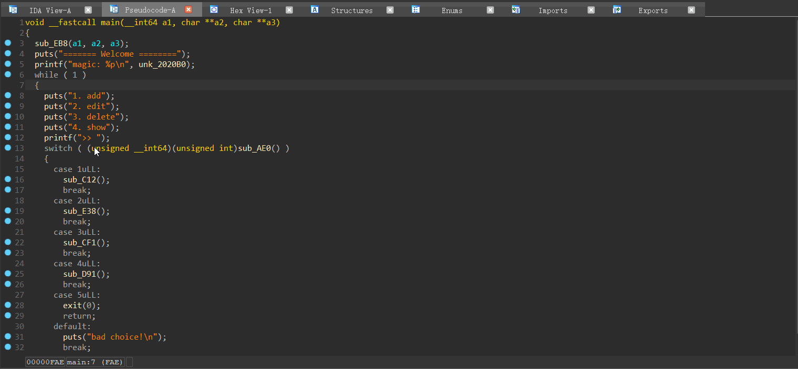

### pre

1. test with hexrays 7.3(x86), hexrays 7.2(x64)

2. do not run with hexrays 7.0, IDA will crash


### usage

1. flod code: {} block, case block. double click or press 'w'



2. code match: TODO
3. simplify c++ decompiled code: TODO

### c++
1. operator
```cpp
v1 = operator<<(&std::cout, p + 8);
v2 = &std::endl;
v3 = operator<<(v1, v2);
=> 
v1 = {&std::cout << (p + 8)};
v2 = &std::endl;
v3 = {v1 << v2};
==> v3 = {&std::cout << (p + 8) << &std::endl};
```
2. template
3. override
4. vtable
